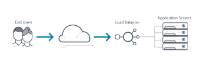
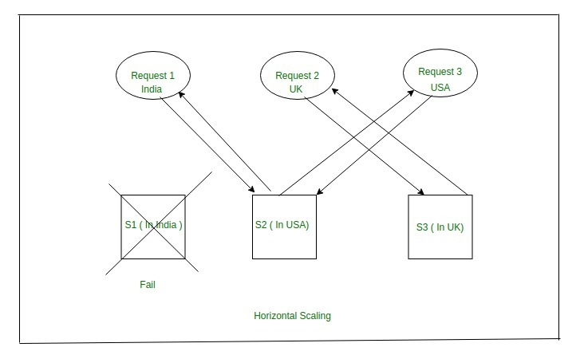
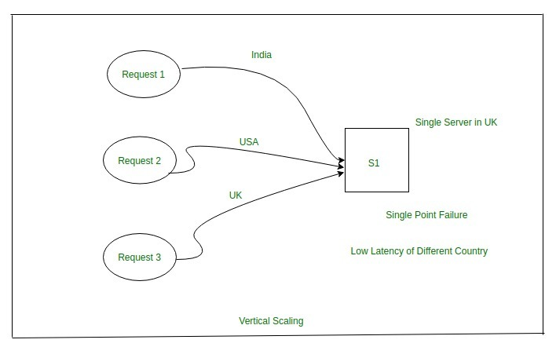

# Load Balancing

Load balancing is the process of distributing network traffic across multiple servers. This ensures no single server bears too much demand. By spreading the work evenly, load balancing improves application responsiveness. It also increases availability of applications and websites for users. Modern applications cannot run without load balancers. Over time, software load balancers have added additional capabilities including security and application.

Load balancing can do more than just act as a network traffic cop. Software load balancers provide benefits like predictive analytics that determine traffic bottlenecks before they happen. As a result, the software load balancer gives an organization actionable insights. These are key to automation and can help drive business decisions.

In the seven-layer Open System Interconnection (OSI) model, network firewalls are at levels one to three (L1-Physical Wiring, L2-Data Link and L3-Network). Meanwhile, load balancing happens between layers four to seven (L4-Transport, L5-Session, L6-Presentation and L7-Application).

## Software Load Balancers vs. Hardware Load Balancers-

Load balancers run as hardware appliances or are software-defined. Hardware appliances often run proprietary software optimized to run on custom processors. As traffic increases, the vendor simply adds more load balancing appliances to handle the volume. Software defined load balancers usually run on less-expensive, standard Intel x86 hardware. Installing the software in cloud environments like AWS EC2 eliminates the need for a physical appliance.

## A load balancer performs the following functions-

**1**) Distributes client requests or network load efficiently across multiple servers.  
**2**) Ensures high availability and reliability by sending requests only to servers that are online.  
**3**) Provides the flexibility to add or subtract servers as demand dictates.

## Load Balancing Algorithms-

### Round Robin –

 Requests are distributed across the group of servers sequentially.

### Least Connections –

A new request is sent to the server with the fewest current connections to clients. The relative computing capacity of each server is factored into determining which one has the least connections.

### Least Time –

Sends requests to the server selected by a formula that combines the
fastest response time and fewest active connections. Exclusive to NGINX Plus.

### Hash –

Distributes requests based on a key you define, such as the client IP address or the request URL. NGINX Plus can optionally apply a consistent hash to minimize redistribution of loads if the set of upstream servers changes.

### IP Hash –

The IP address of the client is used to determine which server receives the request.

## Benefits of Load Balancing

* Reduced Downtime
* Scalable
* Redundancy
* Flexibility
* Efficiency
* Global Server Load Balancing

# Scalability

It's the property of a system or application to handle bigger amounts of work, or to be easily expanded, in response to increased demand for network, processing, database access or file system resources.

## Horizontal scalability-

A system scales horizontally, or out, when it's expanded by adding new nodes with identical functionality to existing ones, redistributing the load among all of them. SOA systems and web servers scale out by adding more servers to a load-balanced network so that incoming requests may be distributed among all of them. Cluster is a common term for describing a scaled out processing system. In this process, the number of servers is increased and not the individual capacity of the server. This is done with the help of a Load Balancer which basically routes the user requests to different servers according to the availability of the server. Thereby, increasing the overall performance of the system. In this way, the entire process is distributed among all servers rather than just depending on a single server.

**Example:**   if there exists a system of the capacity of 8 GB of RAM and in future, there is a requirement of 16 GB of RAM then, rather than the increasing capacity of 8 GB RAM to 16 GB of RAM, similar instances of 8 GB RAM could be used to meet the requirements.

## Advantages of Horizontal Scaling-

* Fault Tolerance means that there is no single point of failure in this kind of scale because there are 5 servers here instead of 1 powerful server. So if anyone of the servers fails then there will be other servers for backup. Whereas, in Vertical Scaling there is single point failure i.e: if a server fails then the whole service is stopped.
* Low Latency: Latency refers to how late or delayed our request is being processed.
* Built-in backup.

## Disadvantages of Horizontal Scaling-

* Not easy to implement as there are a number of components in this kind of scale.
* Cost is high.
* Networking components like, router, load balancer are required.

## Vertical scalability-

A system scales vertically, or up, when it's expanded by adding processing, main memory, storage, or network interfaces to a node to satisfy more requests per system. Hosting services companies scale up by increasing the number of processors or the amount of main memory to host more virtual servers in the same hardware.

**Example:**  When traffic increases, the server degrades in performance. The first possible solution that everyone has is to increase the power of their system. For instance, if earlier they used 8 GB RAM and 128 GB hard drive now with increasing traffic, the power of the system is affected. So a possible solution is to increase the existing RAM or hard drive storage, for e.g. the resources could be increased to 16 GB of RAM and 500 GB of a hard drive but this is not an ultimate solution as after a point of time, these capacities will reach a saturation point.

## Advantages of Vertical Scaling-

* It is easy to implement.
* Reduced software costs as no new resources are added.
* Fewer efforts required to maintain this single system.

## Disadvantages of Vertical Scaling-

* Single-point failure.
* Since when the system (server) fails, the downtime is high because we only have a single server.
* High risk of hardware failures.

**Reference links**

* [www.esds.co.in][1]
* [www.geeksforgeeks.org][2]
* [www.youtube.com][3]

[1]:https://www.esds.co.in/blog/what-is-the-difference-between-horizontal-vertical-scaling/#sthash.tyeLdFJ1.dpbs
[2]:https://www.geeksforgeeks.org/overview-of-scaling-vertical-and-horizontal-scaling/
[3]:https://www.youtube.com/watch?v=K0Ta65OqQkY